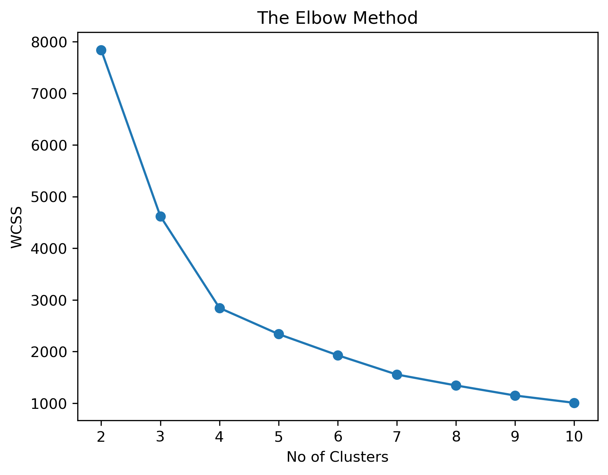
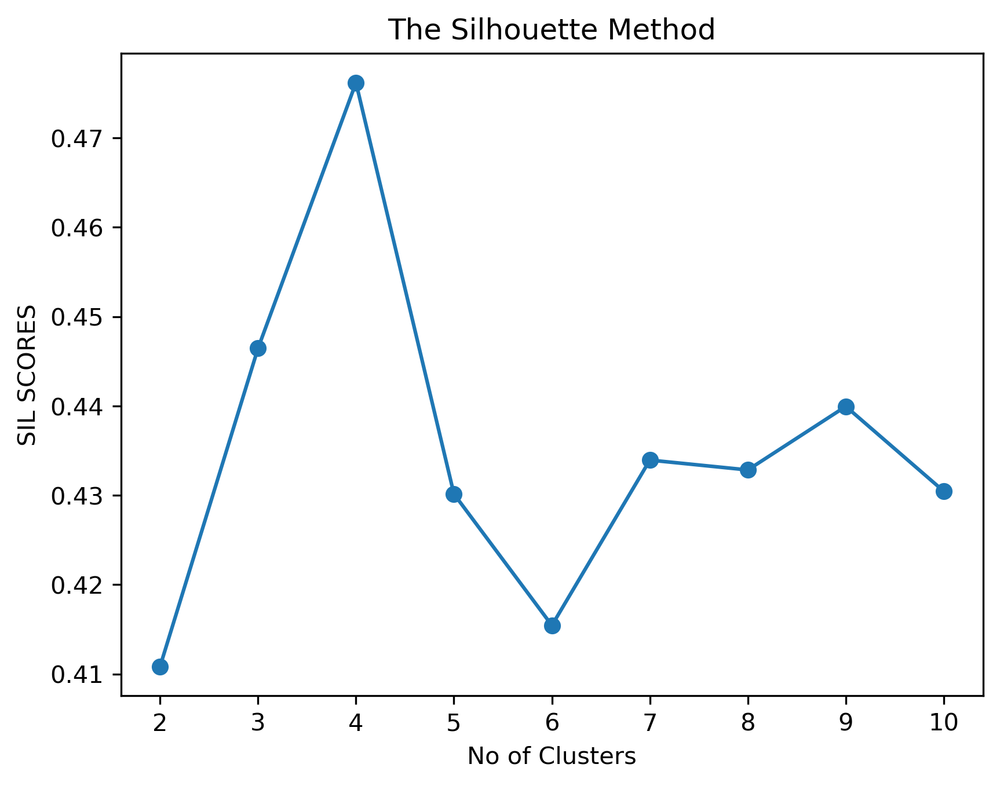
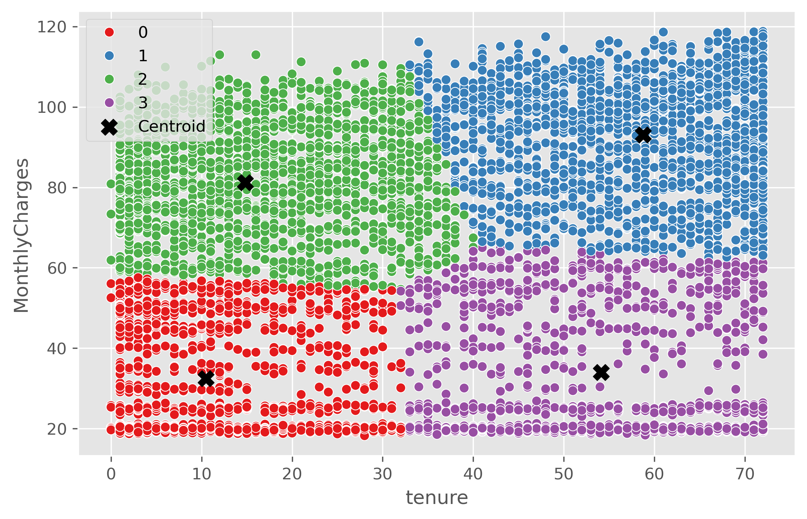

# Customer Segmentation Analysis

## Objective

After analysing individual customer characteristics in the preprocessing stage, I wanted to look at the customer base from a different perspective.

Instead of asking which individual variables are associated with churn, this analysis groups customers with similar characteristics and then compares their churn behaviour.

I used two variables for the segmentation:

* **Tenure** - how long the customer has been with the company
* **Monthly Charges** - how much the customer pays each month

These variables were selected because they are easy to interpret and have a direct business meaning.

I used **K-Means clustering** to create the customer segments.

---

# Selecting the Number of Clusters

The first step was deciding how many customer groups to create.

I tested between **2 and 10 clusters** and used two methods to evaluate the results.

## Elbow Method

The Elbow Method looks at the within-cluster sum of squares (WCSS). As more clusters are added, customers can be grouped more closely, so WCSS decreases.

The elbow plot provides a guide for identifying a reasonable number of clusters. However, the point where the curve bends is not always perfectly clear, so I also used the Silhouette Score.

## Silhouette Method

The Silhouette Score measures how well customers fit within their assigned cluster compared with other clusters. Higher values indicate better separation between groups.

The highest score occurred at **4 clusters**, with a silhouette score of **0.476**.

Based on the two methods, I selected **4 clusters** for the final segmentation.

---

# The Four Customer Segments

The final clusters produced four fairly easy-to-understand customer profiles:

| Cluster   | Customers | Avg. Tenure | Avg. Monthly Charges | Churn Rate |
| --------- | --------: | ----------: | -------------------: | ---------: |
| Cluster 0 |     1,732 | 10.5 months |               $32.47 |     24.54% |
| Cluster 1 |     1,952 | 58.7 months |               $93.02 |     15.63% |
| Cluster 2 |     2,204 | 14.8 months |               $81.22 |     49.18% |
| Cluster 3 |     1,155 | 54.1 months |               $34.03 |      4.76% |

The segmentation can be visualised below.

The chart shows a simple pattern:

* **Left side:** newer customers
* **Right side:** long-term customers
* **Bottom:** lower monthly charges
* **Top:** higher monthly charges

This creates four broad customer profiles.

---

# What the Segments Tell Us

## Cluster 0 - Newer, Lower-Charge Customers

**1,732 customers | 24.54% churn**

These customers have an average tenure of **10.5 months** and pay approximately **$32.47 per month**.

Their churn rate of **24.54%** is close to the overall customer churn rate of **26.54%**.

This is a relatively large group of newer customers, so the business should understand how they are progressing through the early stages of the customer relationship.

**Possible business action:**

Focus on onboarding, early communication and proactive support to make sure customers are successfully established during their first year.

---

## Cluster 1 - Long-Term, Higher-Charge Customers

**1,952 customers | 15.63% churn**

These customers have stayed with the company for an average of **58.7 months** and pay approximately **$93.02 per month**.

Despite having relatively high monthly charges, their churn rate is considerably lower than the newer high-charge segment.

This is an important observation because it shows that **high monthly charges do not automatically correspond to high churn**.

**Possible business action:**

Focus on maintaining these long-term relationships and investigate what is keeping these customers with the company despite their higher monthly charges.

---

## Cluster 2 - Newer, Higher-Charge Customers

**2,204 customers | 49.18% churn**

This segment is the most noticeable result from the clustering analysis.

Customers in this group have an average tenure of only **14.8 months**, while paying approximately **$81.22 per month**.

Their churn rate is **49.18%**, compared with an overall churn rate of **26.54%**.

That means this segment contains a large number of relatively new customers who are also paying higher monthly charges.

The comparison with Cluster 1 makes the finding even more interesting:

|                      |   Cluster 2 |   Cluster 1 |
| -------------------- | ----------: | ----------: |
| Avg. Tenure          | 14.8 months | 58.7 months |
| Avg. Monthly Charges |      $81.22 |      $93.02 |
| Churn Rate           |      49.18% |      15.63% |

The two groups have similarly high monthly charges, but their churn behaviour is very different.

This suggests that **customer tenure is an important part of the story** and that monthly charges should not be analysed in isolation.

**Possible business action:**

Investigate the early customer experience for this group.

Areas worth examining include:

* Onboarding and activation
* Installation experience
* Customer support
* Perceived value of the service
* Contract type
* Service combinations

Rather than automatically offering discounts to all customers in this segment, the business could first identify the reasons these customers are leaving and then test targeted retention actions.

---

## Cluster 3 - Long-Term, Lower-Charge Customers

**1,155 customers | 4.76% churn**

These customers have an average tenure of **54.1 months** and pay approximately **$34.03 per month**.

They have the lowest observed churn rate of all four groups.

This segment provides a useful comparison with Cluster 0.

Both groups have relatively low monthly charges, but the long-term group has a much lower churn rate:

* Cluster 0: **24.54%**
* Cluster 3: **4.76%**

Again, tenure appears to be an important part of the customer story.

**Possible business action:**

The business could investigate what keeps these customers engaged and compare their services, contracts and customer experience with the higher-churn groups.

---

# The Main Business Story

The clustering analysis adds an important layer to the earlier churn analysis.

In the preprocessing analysis, higher monthly charges were associated with higher churn. However, the clustering results show that **monthly charges alone do not tell the whole story**.

The clearest example is the comparison between the two higher-charge groups.

**Cluster 2**

* 14.8 months average tenure
* $81.22 average monthly charges
* 49.18% churn

**Cluster 1**

* 58.7 months average tenure
* $93.02 average monthly charges
* 15.63% churn

Both groups pay relatively high monthly charges, yet their churn rates are very different.

The segmentation therefore gives the business a more useful way to think about churn: **customer characteristics can interact, and certain combinations may identify groups that deserve further investigation.**

---

# Business Opportunities

Based on these segments, the analysis highlights several areas for further action.

### 1. Investigate the newer, higher-charge segment

Cluster 2 contains **2,204 customers** and has a **49.18% observed churn rate**.

Understanding why these customers leave could reveal opportunities to improve retention.

### 2. Improve the early customer journey

The newer customer segments show substantially higher churn than the long-term segments.

The business could review onboarding, activation, support and communication during the first 12–18 months.

### 3. Understand what keeps long-term customers

Clusters 1 and 3 have much longer average tenures and lower churn rates.

Comparing these customers with newer groups could help identify services, contracts or experiences associated with longer customer relationships.

### 4. Use segmentation for targeted analysis

Instead of treating all customers as one population, future retention analysis can use these segments to identify different customer groups and investigate their specific characteristics.

---

# Limitations

This segmentation uses only **tenure and monthly charges**.

Other factors such as contract type, internet service, technical support and other customer characteristics may also help explain why customers churn.

K-Means creates groups based on similarity in the selected variables. The resulting clusters therefore describe patterns in this dataset rather than proving that one characteristic causes another.

The churn rates should also be interpreted as **observed differences between groups**, not predictions of what will happen to an individual customer.

---

# Conclusion

The clustering analysis divided the 7,043 customers into four distinct groups based on **tenure and monthly charges**.

The strongest finding is the difference between **newer, higher-charge customers** and **long-term, higher-charge customers**.

Although both groups have relatively high monthly charges, their observed churn rates are very different. This shows why looking at combinations of customer characteristics can provide more context than analysing individual variables separately.

The segmentation provides a useful foundation for the next stage of the project: using customer characteristics and machine learning to identify **individual customers who may be at higher risk of churn**.
