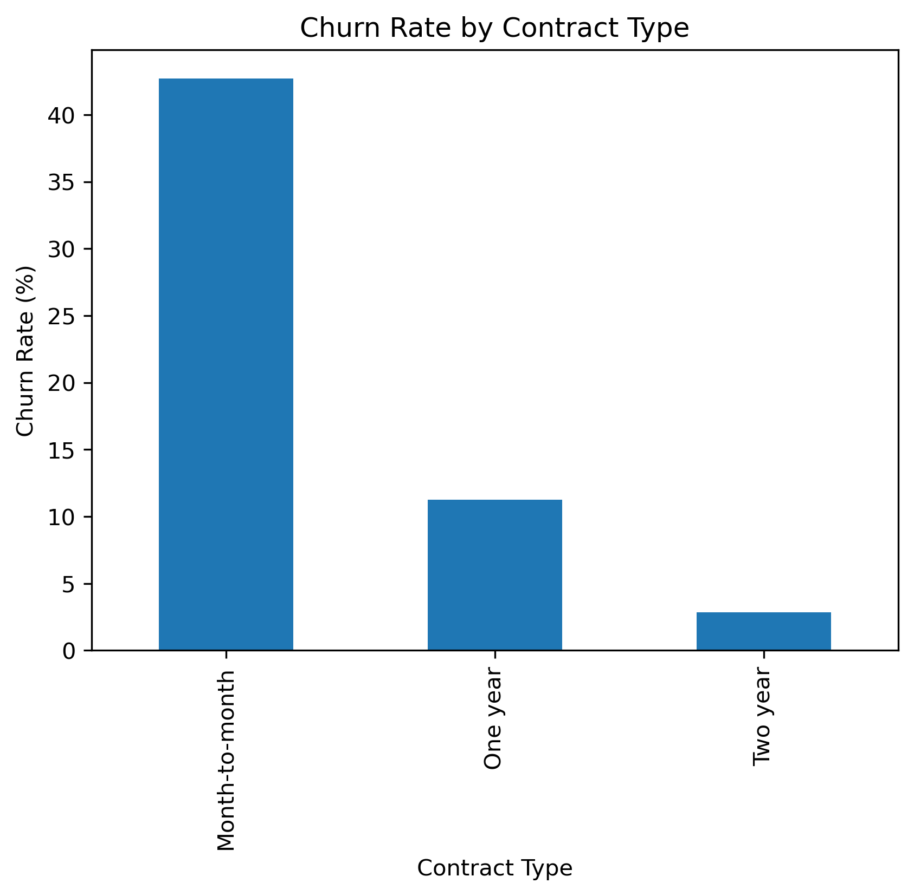
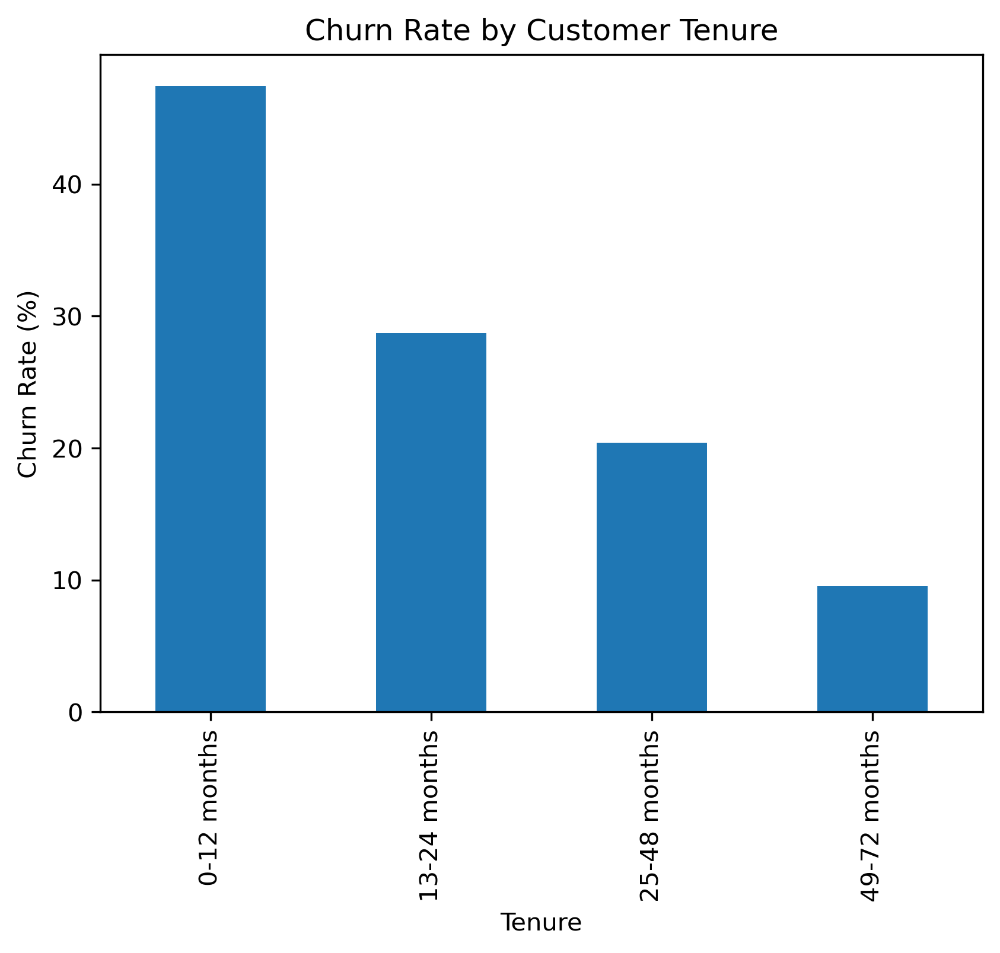
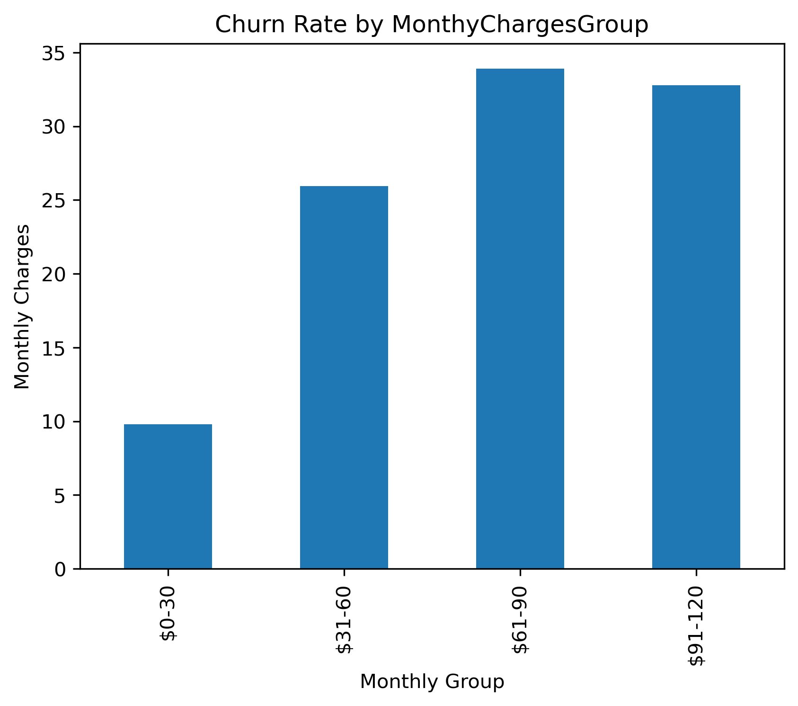

# Customer Churn Analysis

## Objective

The main goal of this analysis is to understand which types of customers are more likely to churn and identify areas where the business could focus its retention efforts.

Python was used for data cleaning and exploratory analysis, PostgreSQL for business analysis, and Power BI for reporting and visualisation.

---

## Data Preparation

The dataset contains **7,043 customers**, of which **1,869 customers have churned**. This gives an overall churn rate of **26.54%**.

Before analysing the data, I:

- Checked for missing values, duplicate records, data types, and invalid categorical values.
- Converted `TotalCharges` to numeric.
- Found 11 blank values in `TotalCharges`. These were converted to `0` because the customers had `tenure = 0`.
- Created `TenureGroup` and `MonthlyChargesGroup` to make the analysis easier to interpret.
- Saved the cleaned dataset to the processed data directory.

---

# Key Findings

## 1. Contract Type Is Closely Related to Churn

| Contract | Churn Rate |
|---|---:|
| Month-to-month | 42.71% |
| One year | 11.27% |
| Two year | 2.83% |

### What the visualisation shows

There is a clear difference in churn across the three contract types.

The churn rate for month-to-month customers is **42.71%**, compared with **11.27%** for one-year contracts and only **2.83%** for two-year contracts.

Looking at the churned customers themselves, **88.55% were on month-to-month contracts**.

### Business action

Month-to-month customers could be an important group to focus on for retention.

The business could test approaches such as:

- Contract upgrade incentives
- Loyalty offers
- Proactive communication before customers decide to leave

It is important to note that this analysis shows an association between contract type and churn. It does not prove that changing the contract type will directly reduce churn.

---

## 2. Churn Is Much Higher During the First Year

| Tenure | Churn Rate |
|---|---:|
| 0–12 months | 47.68% |
| 13–24 months | 28.71% |
| 25–48 months | 20.39% |
| 49–72 months | 9.51% |

### What the visualisation shows

The data shows a strong difference between newer and longer-term customers.

Customers who have been with the company for **0–12 months have a 47.68% churn rate**, while customers with **49–72 months of tenure have a 9.51% churn rate**.

The average tenure also shows a similar pattern:

- Churned customers: **17.98 months**
- Non-churned customers: **37.57 months**

This suggests that the early stage of the customer relationship deserves particular attention.

### Business action

The business could put more effort into the first year of the customer journey.

For example, this could include:

- Better onboarding
- Early customer check-ins
- Proactive support
- Follow-up after the service is activated

The analysis also identified **875 customers** who have both **12 months or less tenure and monthly charges above $70**.

This could be a useful segment for further retention analysis.

---

## 3. Higher Monthly Charges Are Associated with Higher Churn

| Monthly Charges | Churn Rate |
|---|---:|
| $0–30 | 9.80% |
| $31–60 | 25.93% |
| $61–90 | 33.91% |
| $91–120 | 32.78% |

### What the visualisation shows

Customers with higher monthly charges generally have higher churn rates, although the relationship is not completely linear.

Churn is **9.80%** for customers paying $0–30 per month and increases to **33.91%** for customers paying $61–90 per month.

The rate then decreases slightly to **32.78%** for customers paying $91–120.

There is also a difference in average monthly charges:

- Churned customers: **$74.44**
- Non-churned customers: **$61.27**

### Business action

Higher-charge customers may represent a larger business exposure when they churn.

The business could investigate whether these customers feel they are receiving enough value for what they pay.

Areas to investigate include:

- Pricing
- Service bundles
- Customer support
- Customer experience

---

# Supporting Insight

Internet service also shows a noticeable difference in churn:

| Internet Service | Churn Rate |
|---|---:|
| No internet service | 7.40% |
| DSL | 18.96% |
| Fiber optic | 41.89% |

The highest churn rate in the combinations analysed was **54.61% for fiber optic customers on month-to-month contracts**.

This group could be investigated further to understand whether factors such as pricing, service quality, installation experience, or customer support are contributing to the higher churn rate.

---

# Business Recommendations

Based on the findings, the business could focus its retention analysis on four areas:

### 1. Month-to-month customers

Identify customers in this group who also have other churn indicators and test targeted retention offers or contract upgrade incentives.

### 2. New customers

Strengthen the onboarding process and monitor customers during their first 12 months.

### 3. Higher-charge customers

Look at whether customers with higher monthly charges are receiving enough value from their services.

### 4. High-risk combinations

Analyse combinations such as **fiber optic + month-to-month** and **high monthly charges + month-to-month** to identify more specific customer segments.

These findings highlight areas worth investigating and testing. They should not be treated as proof that any single factor directly causes churn.

---

# Conclusion

The analysis shows that churn is not evenly distributed across the customer base.

**Month-to-month customers, newer customers, and customers with higher monthly charges show noticeably higher churn rates in this dataset.**

Looking at these characteristics together can provide a more useful view of potential retention segments than looking at each characteristic separately.

These findings provide a starting point for the next stage of the project, where customer characteristics can be combined through **customer segmentation and churn prediction** to identify customers who may be at higher risk of leaving.
